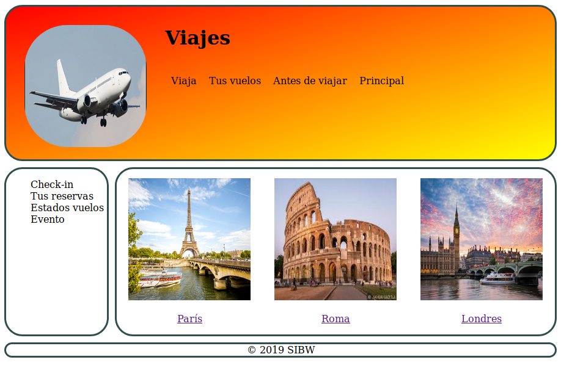

# Pruebas sobre la potencia que tiene React.js

## La página resultante del proyecto se muestra a continuación

No se ha optado por hacer pocas clase y poner todo el código en ellas,
sino que se ha adoptado por crear todo como un puzzle
	
**Se ha optado por crear la página como si fueran piezas y poco a poco**

- Diseño
	- Cabecera
		- Imagen
		- Navegacion Superior
	- Principal
		- Navegación Lateral
		- Main
			- Eventos
				- Enlace
				- Foto
				- Nombre de la ciudad
		- Pie

- **Viajes está agregado como un submódulo**
	- **url viajes: https://github.com/iscoct/viajes**
